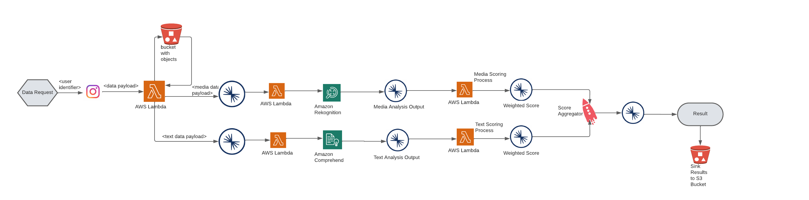
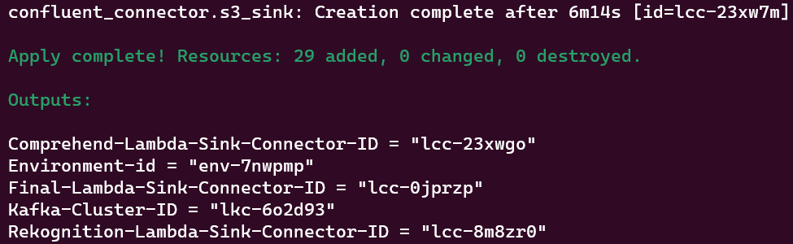
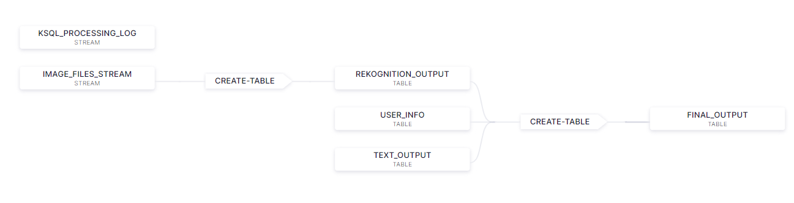
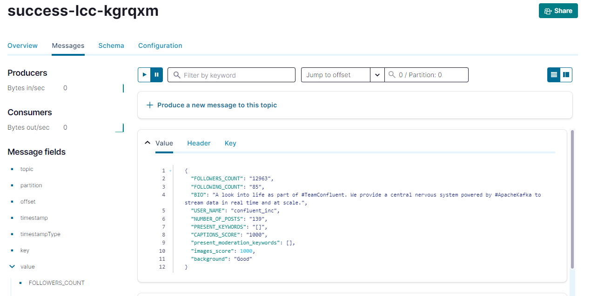
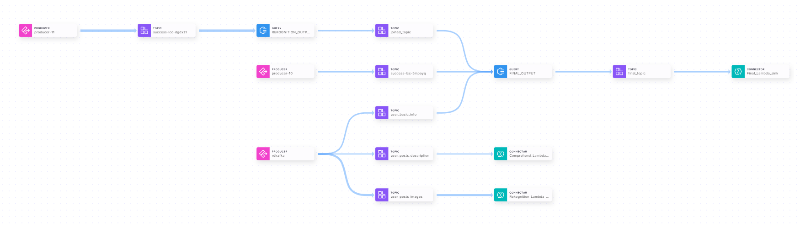

<div align="center" padding=25px>
    
</div>

# <div align="center">Social Media Background Check</div>

In today's digital age, the presence of social media has become an integral part of the individual's identity. As a result, employers are increasingly incorporating social media background checks into their fitment processes. The purpose of a social media background check is to gain a deeper understanding of an individual beyond their resume and interview performance. By reviewing their social media profiles, employers can assess factors such as professionalism, communication skills, cultural fit, and potential concerns that may impact their suitability for the position.

This demo guides you through the process of incorporating social media background check for instagram users in real-time. You can just as easily use similar concepts for pulling data from Facebook, linkedin or other social platforms.

## Architecture Diagram

This demo makes use of a Python script to scrape the individuals information from instagram and produce the same to Confluent Cloud. The events are then processed using AWS Comprehend, AWS Rekognition, and AWS Lambdas where the user data is checked using AWS provided Machine Learning tools and stream processing using ksqlDB to provide the information related to individuals background. We are sinking the data into S3 where this data can in turn be pulled by other downstream systems. 

This demo is a AWS native solution to perform social media background check on individuals similarly you can just as easily use services on GCP or Azure.

We are using terraform to setup the complete infrastructure including aws lambdas, iam role , confluent cloud cluster, ksqldb cluster, service accounts, Fully Managed AWS Lambda Sink Connectors, etc.
For the machine learning and AI part we are leveraging the following AWS Services:
- AWS Rekognition :- To detect whether the users post images content is inappropriate, unwanted, or offensive.
- AWS Comprehend  :- To extract key phrases, important topics for the user posts captions 

<div align="center"> 
  
</div>


# Requirements

In order to successfully complete this demo you need to install few tools before getting started.

- If you don't have a Confluent Cloud account, sign up for a free trial [here](https://www.confluent.io/confluent-cloud/tryfree).
- Install Confluent Cloud CLI by following the instructions [here](https://docs.confluent.io/confluent-cli/current/install.html).
- Please follow the instructions to install Terraform if it is not already installed on your system.[here](https://developer.hashicorp.com/terraform/tutorials/aws-get-started/install-cli)  
- This demo uses Python 3.9.13 version.
- This demo uses python modules. You can install this module through `pip`.
  ```
  pip3 install instaloader
  pip3 install boto3
  pip3 install itertools
  ```
- In this demo we are going to deploy all our infrastructure in AWS ap-south-1 region. Therefore, update your aws region to ap-south-1 using aws configure.
   <div align="center"> 
      
   </div>

## Prerequisites

### Confluent Cloud

1. Sign up for a Confluent Cloud account [here](https://www.confluent.io/get-started/).
1. After verifying your email address, access Confluent Cloud sign-in by navigating [here](https://confluent.cloud).
1. When provided with the _username_ and _password_ prompts, fill in your credentials.

   > **Note:** If you're logging in for the first time you will see a wizard that will walk you through the some tutorials. Minimize this as you will walk through these steps in this guide.

1. Create Confluent Cloud API keys by following the steps in UI.Click on the button that is present on the right top section and click on Cloud API Key.
<div align="center"> 
  
</div>

 Now Click Add Key to generate API keys and store it as we will be using that key in this demo.
 <div align="center"> 
  
</div>
    
   > **Note:** This is different than Kafka cluster API keys.

## Setup

1. Clone the repository

```
git clone https://github.com/devesh-98/solutionshub-social-media-background-check.git
```
2. This demo uses Terraform  to spin up resources that are needed.

3. Update the `terraform/variables.tf` file for the following variables with your Cloud API credentials and AWS Access Keys.

```
variable "confluent_cloud_api_key" {
  default = " Replace with your API Key created during pre-requsite"   
}

variable "confluent_cloud_api_secret" {
  default = "Replace with your API Key created during pre-requsite"   
}

variable "aws_cloud_access_key" {
  default = " Replace with your AWS Access Key "
}

variable "aws_cloud_secret_key" {
  default = " Replace with your AWS Secret Key "
}

```
 ### Build your cloud infrastructure

1. Navigate to the repo's terraform directory.
   ```bash
   cd terraform
   ```

2. Initialize Terraform within the directory.
   ```
   terraform init
   ```

3. Preview the actions Terraform would take to modify your infrastructure or Check if there are any errors in the code.
   ```
   terraform plan
   ```

4. Apply the plan to create the infrastructure.

   ```
   terraform apply 
   ```

   > **Note:** Read the `main.tf` configuration file [to see what will be created](./terraform/main.tf).

5. Once everything is deployed successfully you will be able to see the further required connector id's as follows:
   <div align="center"> 
        
   </div>


 # Demo
## Execute Python Script by providing Instagram Username to check Background

Please run the Python script located in the Python script folder. Before running it, make sure to replace the below mentioned  configuration settings in the code to point to your Confluent Cloud cluster that you created.

Please change the following values in the client.properties file
```
BOOTSTRAP_SERVERS = ''  # Replace with your Confluent Cloud bootstrap servers
SASL_USERNAME = ''  # Replace with your Confluent Cloud API key
SASL_PASSWORD = ''  # Replace with your Confluent Cloud API secret
```
To obtain the following details, navigate to the Clients section on the Confluent Cloud UI and select Python as the script type. From there, you can copy the bootstrap server and API Key details and replace them in the code.

<div align="center"> 
  
</div>

Also change the following values in the producer.py file.
```
instagram_username='' # Replace with any public instagram username
access_key='' #Replace with your AWS Access Key which has full access to S3
secret_key='' #Replace with your AWS Secret Key

And inside function download_users_posts_with_periods() change the period according to need:
SINCE=''
UNTIL=''
```

Please run the Python script using the following syntax:

```
python producer.py
```


## Data Streams with ksqlDB

Now that you have data flowing through Confluent, you can now easily build stream processing applications using ksqlDB. You are able to continuously transform, enrich, join, and aggregate your data using simple SQL syntax. You can gain value from your data directly from Confluent in real-time. Also, ksqlDB is a fully managed service within Confluent Cloud with a 99.9% uptime SLA. You can now focus on developing services and building your data pipeline while letting Confluent manage your resources for you.

This section will involve the creation of a KStreams where we are aggregating the results generated from AWS Comprehend and AWS Rekognition for each post of user on social media in real-time using simple SQL-like commands.

If you’re interested in learning more about ksqlDB and the differences between streams and tables, I recommend reading these two blogs [here](https://www.confluent.io/blog/kafka-streams-tables-part-3-event-processing-fundamentals/) and [here](https://www.confluent.io/blog/how-real-time-stream-processing-works-with-ksqldb/).

1. On the navigation menu click on **ksqlDB** and step into the cluster you created during setup.
   To write streaming queries against topics, you will need to register the topics with ksqlDB as a stream or table.

2. **VERY IMPORTANT** -- At the bottom of the editor, set `auto.offset.reset` to `earliest`, or enter the statement:

   ```SQL
   SET 'auto.offset.reset' = 'earliest';
   ```

   If you use the default value of `latest`, then ksqlDB will read form the tail of the topics rather than the beginning, which means streams and tables won't have all the data you think they should.

3. Create a ksqlDB stream for Rekognition Output

   ```SQL
   CREATE STREAM IMAGE_FILES_STREAM (BUCKET STRING, S3_PATH STRING, USERNAME STRING, MODERATIONLABELS ARRAY<STRING>) 
   WITH (KAFKA_TOPIC='success-<Enter Rekognition Lambda Sink Connector ID here>', KEY_FORMAT='JSON', VALUE_FORMAT='JSON'); 
   ```
   
   
   **EXPLANATION**

   A stream represents a series of messages flowing in from an input topic which has been deserialized from bytes and has a schema applied to it so the data can be processed in ksqlDB. The output of AWS Rekognition Moderation Labels for each user post is streamed into this stream.

4. Create `TEXT_OUTPUT` table which will have output of captions text data .

   ```SQL
    CREATE TABLE TEXT_OUTPUT (USERNAME STRING PRIMARY KEY, CAPTIONS_SCORE INTEGER, S3_PATH STRING, PRESENT_KEYWORDS ARRAY<STRING>) 
    WITH (KAFKA_TOPIC='success-<Enter Comprehend Lambda Sink Connector ID here>', KEY_FORMAT='KAFKA', VALUE_FORMAT='JSON');

   ```

5. Create `USER_INFO` table which will hold all user related information on user_basic_info topic.

   ```SQL
   CREATE TABLE USER_INFO (
    USERNAME STRING PRIMARY KEY, NUMBER_OF_POSTS INTEGER, FOLLOWERS_COUNT INTEGER, FOLLOWING_COUNT INTEGER, BIO STRING, EXTERNAL_URL STRING) 
   WITH (KAFKA_TOPIC='user_basic_info', KEY_FORMAT='KAFKA', VALUE_FORMAT='JSON');
   ```

7. Create `REKOGNITION_OUTPUT` table which will aggregate all outputs for all posts of user from Rekognition .

   ```SQL
    CREATE TABLE REKOGNITION_OUTPUT WITH (KAFKA_TOPIC='joined_topic') 
    AS SELECT
      IMAGE_FILES_STREAM.USERNAME USERNAME,
      COLLECT_LIST(IMAGE_FILES_STREAM.MODERATIONLABELS) MODERATIONLABELS
    FROM IMAGE_FILES_STREAM IMAGE_FILES_STREAM
    GROUP BY IMAGE_FILES_STREAM.USERNAME
    EMIT CHANGES;
   ```

8. Create `FINAL_OUTPUT` table which will join and aggregate all outputs Rekognition, Comprehend and User info.

   ```SQL
    CREATE TABLE FINAL_OUTPUT WITH (KAFKA_TOPIC='final_topic') 
    AS SELECT
      USER_INFO.USERNAME USER_INFO_USERNAME,
      USER_INFO.NUMBER_OF_POSTS NUMBER_OF_POSTS,
      USER_INFO.FOLLOWERS_COUNT FOLLOWERS_COUNT,
      USER_INFO.FOLLOWING_COUNT FOLLOWING_COUNT,
      USER_INFO.BIO BIO,
      TEXT_OUTPUT.PRESENT_KEYWORDS PRESENT_KEYWORDS,
      TEXT_OUTPUT.CAPTIONS_SCORE CAPTIONS_SCORE,
      REKOGNITION_OUTPUT.MODERATIONLABELS MODERATIONLABELS,
      REKOGNITION_OUTPUT.USERNAME USER_NAME
    FROM USER_INFO USER_INFO
    INNER JOIN TEXT_OUTPUT TEXT_OUTPUT ON ((USER_INFO.USERNAME = TEXT_OUTPUT.USERNAME))
    INNER JOIN REKOGNITION_OUTPUT REKOGNITION_OUTPUT ON ((USER_INFO.USERNAME = REKOGNITION_OUTPUT.USERNAME))
    EMIT CHANGES;
   ```
9.  Verify the KSQLdb Flow Diagram with below once you are done running all the above queries successfully.
    <div align="center"> 
      
    </div>

10. Now check the background check output data in the success topic (success- final_lambda_sink_connector_id) of the Final Lambda Sink Connector.
    <div align="center"> 
      
    </div>

11. Similarly you can check the background of as many public Instagram accounts as you want in real-time by just changing the username in producer python code.
    


# Teardown

You want to delete any resources that were created during the demo so you don't incur additional charges.


## Infrastructure

1. Run the following command to delete all resources created by Terraform
   ```bash
   terraform destroy
   ```   

# Confluent Cloud Stream Governance

Confluent offers data governance tools such as Stream Quality, Stream Catalog, and Stream Lineage in a package called Stream Governance. These features ensure your data is high quality, observable and discoverable. Learn more about **Stream Governance** [here](https://www.confluent.io/product/stream-governance/) and refer to the [docs](https://docs.confluent.io/cloud/current/stream-governance/overview.html) page for detailed information.

1.  Navigate to https://confluent.cloud
1.  Use the left hand-side menu and click on **Stream Lineage**.
    Stream lineage provides a graphical UI of the end to end flow of your data. Both from the a bird’s eye view and drill-down magnification for answering questions like:

    - Where did data come from?
    - Where is it going?
    - Where, when, and how was it transformed?

In our use case, the stream lineage appears as follows: we utilize a Python script to generate events that are sent to the 3 topics user_basic_info, user_posts_description and user_post_images. This topics are triggering the Lambda Sink Connectors. Over these Lambda Sink Connectors Success topics we are creating KSQLDB stream and tables and aggregating them to check the background details of an individual.


<div align="center">
  
</div>


# References
1. Confluent Cloud cluster types [page](https://docs.confluent.io/cloud/current/clusters/cluster-types.html)
2. ksqlDB [page](https://www.confluent.io/product/ksqldb/) and [use cases](https://developer.confluent.io/tutorials/#explore-top-use-cases)
3. Stream Governance [page](https://www.confluent.io/product/stream-governance/) and [doc](https://docs.confluent.io/cloud/current/stream-governance/overview.html)
4. RBAC in Confluent Cloud [page](https://docs.confluent.io/cloud/current/access-management/access-control/rbac/overview.html)
5. Terraform provider for Confluent [page](https://registry.terraform.io/providers/confluentinc/confluent/latest/docs)

  
